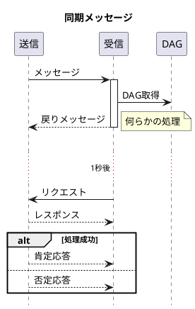
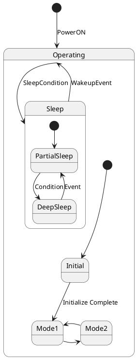
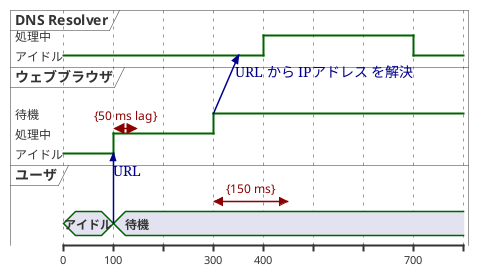
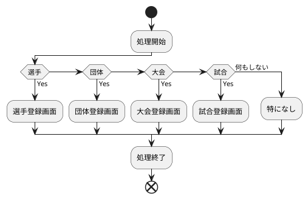

<link href="/style.less" rel="stylesheet"></link>

**<span style="font-size: 200%;">レビュー表示方法</span>**
Ctrl+Shift+P > Markdown preview to the side

**<span style="font-size: 200%;">見出し番号の自動採番設定</span>**
Ctrl+Shift+P > Markdown Preview Enhanced : Customize CSS
→style.lessの内容を張り付ける

**<span style="font-size: 200%;">見出し番号の自動採番設定</span>**
以下サンプルコード
___

# 見出し
冒頭に「#」を入力することで、見出しを作ることができます。
「#」の数で見出しの大きさを変えられます。
# わたしの一日
## わたしの一日
## わたしの一日
## わたしの一日
### わたしの一日
### わたしの一日
#### わたしの一日
##### わたしの一日
###### わたしの一日

# 箇条書き
文字の前に「*」（アスタリスク）をつけることで、箇条書きになります。
* 散歩した
* ショッピングした
* 公園へ行った

# ナンバーリング
文字の前に数字とピリオドを入力することで番号をふることができます。
1. 散歩した
2. ショッピングした
3. 公園へ行った


# 水平線
「*」アスタリスク・「-」ハイフン・「＿」アンダーバーを、3つ以上入力すると「水平線」を表示できます。
散歩した
***
ショッピングした
—
公園へ行った
___

# チェックボックス
‐（ハイフン）［ ］（大カッコ）を入力することで、チェックボックスを表示することができます。
行選択「Alt + C」でチェックボックスに選択可能
- [ ] aaa
- [ ] 散歩
- [ ] ショッピング

# テーブル
以下のように入力すると、テーブルが表示されます。
Text Tablesから作成Ctrl+Q Ctrl+Fで成形
| 年月日      | 名前  | 備考１ | 備考２  | 備考３ |
| -------- | --- | --- | ---- | --- |
| 2000/1/2 | タロウ | 笑   | よくいる | 昼   |

# 強調
文を「*」アスタリスク2個ずつで囲むと、「大文字」に表示できます。
**わたしの一日**

# 斜体
文を「*」アスタリスク1個で囲むこと、「斜体」に表示できます。
*わたしの一日*

# 「画像・リンク」で使うマークダウン記法
リンク
[リンクテキスト](URL)と入力することで、指定したURLへリンクできるようになります。
[グーグル](https://www.google.com/?hl=ja)

# 画像
*！【代替テキスト】（URL ）と入力することで、「画像」を表示することができます。


# 引用
引用元の前に「>」を入力することで、引用表記できます。
> あなたの一日

# UML
```plantuml
actor "利用者" as user
actor "システム" as system

user -> system : 認証要求
system -> user : 認証結果
```

```plantuml
left to right direction
actor "利用者" as user
rectangle "システム" as system {
    usecase "認証要求" as push
    usecase "認証結果取得" as get
}
user--push
user--get
```

# UML(シーケンス図)


# UML(状態遷移図)


# UML(タイミング図)


# UML(アクティビティ図)
参考URL:https://simplest-system.jp/2018/06/22/post-89/


# ライン
---

# ブロッククォート
> hoge
> fuga
> piyo

# インラインコード
This is `code`

# コード
```java
const number = 123
console.log(number)
```

# コード(行番号つき)
```java {.line-numbers}
const number = 123
console.log(number)
```

# コード(行の強調)
```java {highlight=2}
const number = 123
console.log(number)
```

# コード(行番号つき + 行の強調)
```java {highlight=2,.line-numbers}
const number = 123
console.log(number)
```

# 数式
$$
f(x) = \int_{-\infty}^{\infty}
    \hat f(\xi)\,e^{2 \pi i \ xi x}
    \,d\xi
$$

# 色変え
一旦直接埋込
タグを<span style="color:red">直接記述</span>することで<span style="color:blue" >色</span>を変えます。

<table>
<tr><td>№<td>色<td>値
<tr><td>1<td bgcolor=white>white<td>#ffffff
<tr><td>2<td bgcolor=black><font color=white>black<td>#000000
<tr><td>3<td bgcolor=red><font color=white>red<td>#ff0000
<tr><td>4<td bgcolor=blue><font color=white>blue<td>#0000ff
<tr><td>5<td bgcolor=yellow>yellow<td>#ffff00
<tr><td>6<td bgcolor=green><font color=white>green<td>#008000
<tr><td>7<td bgcolor=orange>orange<td>#ffa500
<tr><td>8<td bgcolor=pink>pink<td>#ffc0cb
</table>

|№|色|値|
|:-:|:-:|:-:|
|1<td bgcolor=white>white|#ffffff|
|2<td bgcolor=black><font color=white>black|#000000|
|3<td bgcolor=red><font color=white>red|#0000ff|
|4<td bgcolor=blue><font color=white>blue|#ffff00|
|5<td bgcolor=yellow>yellow|#ffff00|
|6<td bgcolor=green><font color=white>green|#ffff00|
|7<td bgcolor=orange>orange|#ffff00|
|8<td bgcolor=pink>pink|#ffff00|
